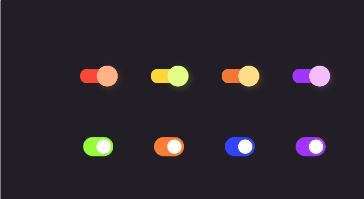
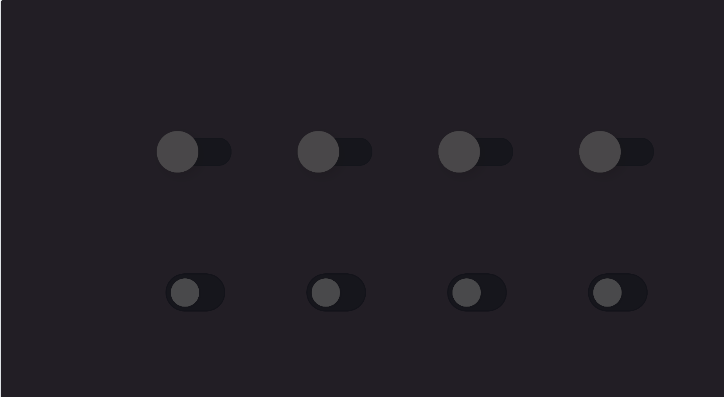

# 🎛️ Unity Switch Toggle

A **custom UI toggle switch** for Unity, featuring color changes and position shifting.

---

## 🚀 Features

- **Customizable Colors**: Change **background** and **handle** colors when toggled.
- **Smooth Toggle Handling**: Updates UI instantly when toggled.
- **Easy Integration**: Works with Unity's built-in `Toggle` component.

---





## 📦 Installation

1. **Clone the repository**:
   ```sh
   git clone https://github.com/your-username/UnitySwitchToggle.git
